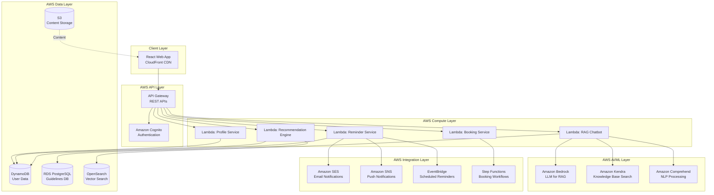
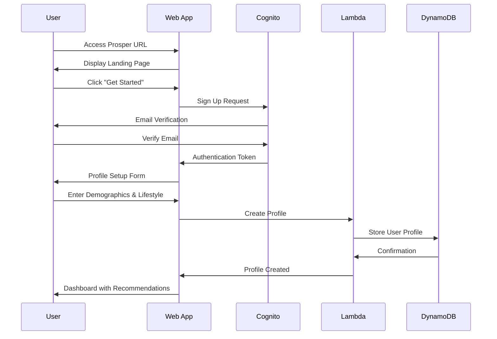
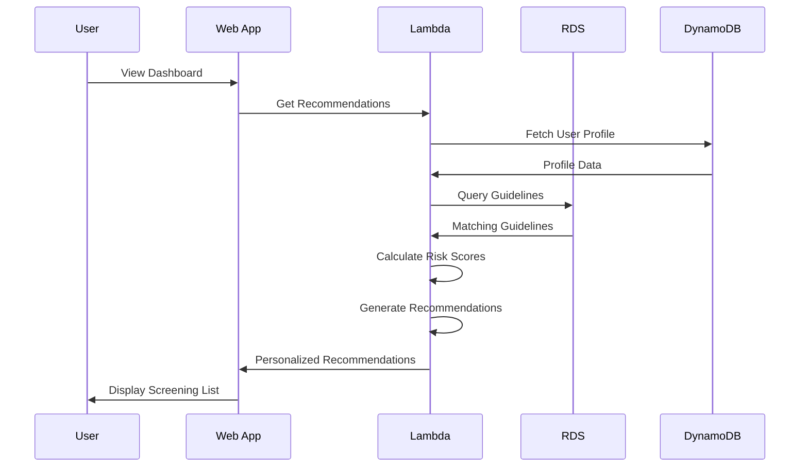
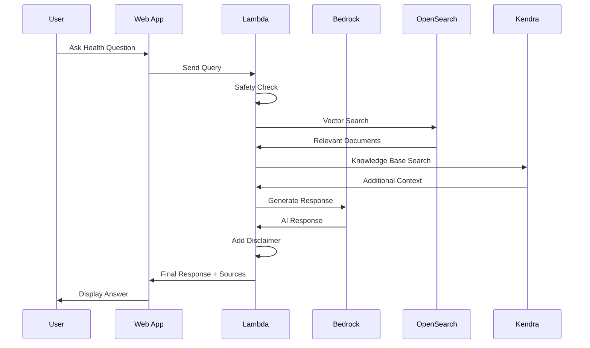
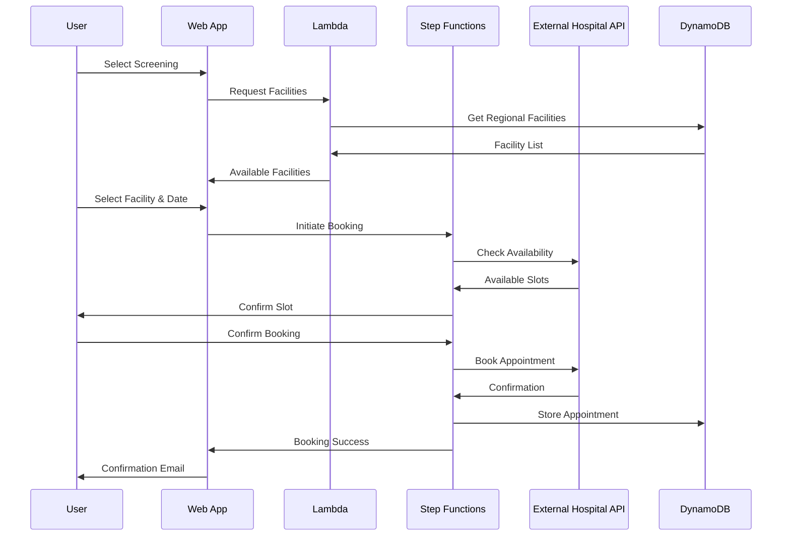
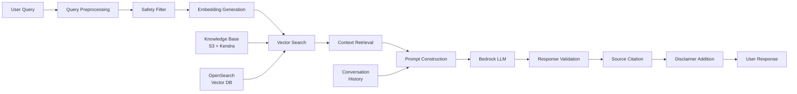
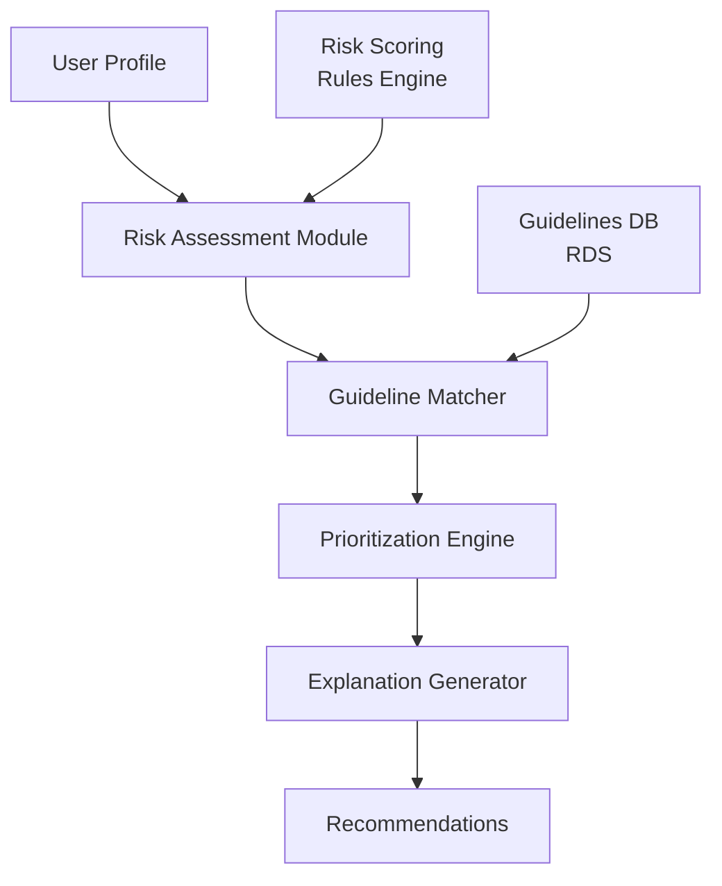
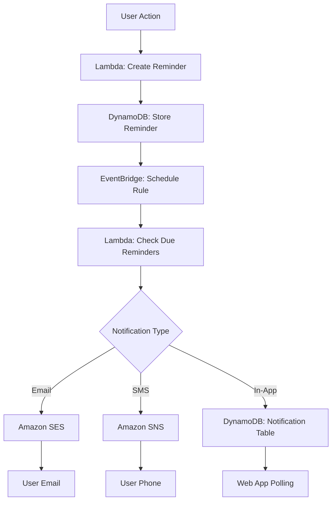
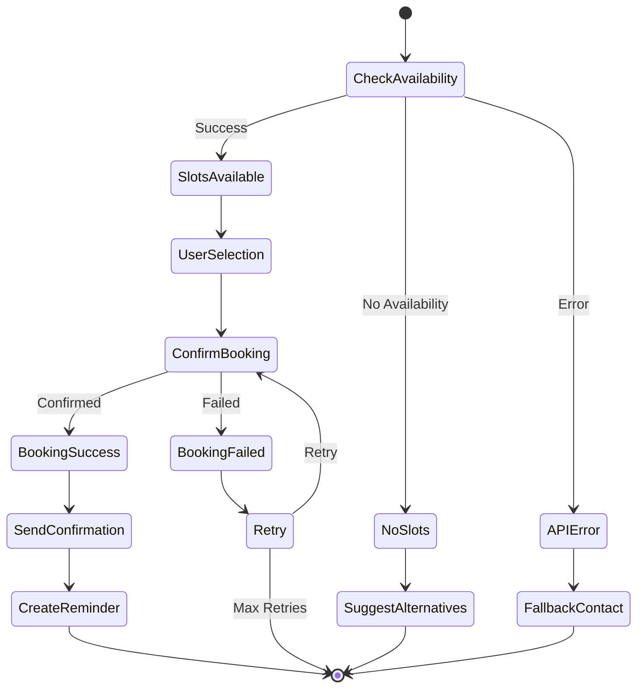

# Design Document: Prosper - Preventive Healthcare Web Application

## Overview

Prosper is a cloud-native, serverless web application built on AWS infrastructure that provides personalized preventive healthcare guidance. The system leverages AWS managed services for scalability, reliability, and security while implementing responsible AI principles for health screening recommendations and cancer awareness.

The application uses a modern web architecture with React frontend, serverless backend (AWS Lambda), and AI/ML components including a RAG-based chatbot powered by Amazon Bedrock. All data processing uses synthetic or publicly available information, ensuring no real patient data is involved.

### Key Design Principles

1. **Cloud-Native Architecture**: Fully serverless on AWS for automatic scaling and cost optimization
2. **Privacy-First**: End-to-end encryption, minimal data collection, HIPAA-aligned practices
3. **Responsible AI**: Transparent, explainable recommendations with clear non-diagnostic boundaries
4. **Evidence-Based**: All recommendations derived from publicly validated medical guidelines
5. **Accessible**: WCAG 2.1 AA compliant, responsive design for all devices
6. **Hackathon-Ready**: Modular design for rapid development and demonstration

### Core Constraints

- **No Real Patient Data**: Only synthetic or publicly available data
- **No Diagnostic Outputs**: Clear disclaimers and safety guardrails
- **Responsible AI**: Bias mitigation, transparency, and explainability
- **Scalable**: Handle variable load from hackathon demo to production

## High-Level Architecture



## User Flow

### 1. Onboarding Flow


### 2. Recommendation Generation Flow


### 3. Chatbot Interaction Flow


### 4. Appointment Booking Flow


## Data Flow

### Profile Data Flow
```
User Input → API Gateway → Lambda (Validation) → DynamoDB (Encrypted) → Cache (ElastiCache)
```

### Recommendation Data Flow
```
User Profile → Lambda → Risk Assessment → Guideline Matching (RDS) → Prioritization → Response
```

### Chatbot Data Flow
```
User Query → Safety Filter → Embedding Generation → Vector Search (OpenSearch) → 
Context Retrieval → LLM (Bedrock) → Response Validation → Source Citation → User
```

### Reminder Data Flow
```
User Action → Lambda → DynamoDB → EventBridge Rule → Lambda (Trigger) → 
SES/SNS → Email/Push Notification → User
```

## AWS Technology Stack

### Frontend
- **Framework**: React 18 with TypeScript
- **UI Library**: Material-UI (MUI) or Chakra UI
- **State Management**: Redux Toolkit + RTK Query
- **Hosting**: Amazon S3 + CloudFront CDN
- **Build**: AWS Amplify or CodePipeline

### Backend Services
- **Compute**: AWS Lambda (Node.js 20.x runtime)
- **API**: Amazon API Gateway (REST APIs)
- **Authentication**: Amazon Cognito (User Pools)
- **Authorization**: Cognito + IAM roles

### AI/ML Components
- **LLM**: Amazon Bedrock (Claude 3 or Titan)
- **Knowledge Base**: Amazon Kendra
- **Vector Search**: Amazon OpenSearch Service
- **NLP**: Amazon Comprehend Medical
- **Embeddings**: Bedrock Titan Embeddings

### Data Storage
- **User Data**: Amazon DynamoDB (NoSQL)
- **Guidelines**: Amazon RDS PostgreSQL
- **Content**: Amazon S3
- **Cache**: Amazon ElastiCache (Redis)
- **Vector Store**: OpenSearch with k-NN plugin

### Integration Services
- **Workflows**: AWS Step Functions
- **Events**: Amazon EventBridge
- **Email**: Amazon SES
- **Notifications**: Amazon SNS
- **Queue**: Amazon SQS

### Security & Compliance
- **Encryption**: AWS KMS
- **Secrets**: AWS Secrets Manager
- **WAF**: AWS WAF
- **Monitoring**: Amazon CloudWatch
- **Logging**: CloudWatch Logs
- **Audit**: AWS CloudTrail

### DevOps
- **IaC**: AWS CDK or Terraform
- **CI/CD**: AWS CodePipeline + CodeBuild
- **Monitoring**: CloudWatch + X-Ray
- **Error Tracking**: CloudWatch Insights

## AI Components

### 1. RAG Chatbot Architecture



#### Knowledge Base Construction

**Data Sources**
- CDC guidelines and fact sheets
- WHO health screening recommendations
- USPSTF screening guidelines
- National Cancer Institute resources
- American Cancer Society guidelines
- Regional health authority publications

**Processing Pipeline**
1. **Document Ingestion**: S3 bucket with organized health documents
2. **Chunking**: Split documents into 500-token chunks with overlap
3. **Embedding**: Generate embeddings using Bedrock Titan Embeddings
4. **Indexing**: Store in OpenSearch with k-NN index
5. **Metadata**: Tag with source, date, credibility, topic
6. **Kendra Integration**: Index full documents for semantic search

**Update Process**
- Monthly automated refresh from public health sources
- Version control for guideline changes
- A/B testing for retrieval improvements

#### Safety Mechanisms

**Query Classification Process**

The system employs Amazon Comprehend Medical to analyze incoming user queries and detect clinical intent. Each query is processed through a multi-stage classification pipeline that identifies whether the user is seeking diagnostic information, treatment recommendations, or emergency assistance. The classification engine examines medical entities, contextual keywords, and semantic patterns to categorize queries into safe or restricted categories.

When a diagnostic intent is detected, the query is flagged as requiring redirection to healthcare professionals. Treatment-related queries are similarly identified and blocked from generating medical advice. Emergency keywords trigger immediate safety protocols that direct users to appropriate emergency services.

**Response Filtering Strategy**

All chatbot responses pass through a validation layer that actively blocks diagnostic language and prevents treatment recommendations. The system automatically injects disclaimers into every response, clearly stating the educational and non-diagnostic nature of the information provided. For emergency situations, the system immediately redirects users to call emergency services rather than attempting to provide guidance.

**Fallback Response Handling**

When diagnostic queries are detected, the system responds with clear guidance directing users to consult healthcare professionals for medical diagnosis. Treatment-related queries receive responses that emphasize the importance of speaking with qualified doctors. Emergency situations trigger immediate fallback messages instructing users to contact emergency services without delay, ensuring user safety remains the top priority.

### 2. Screening Eligibility Engine

#### Guideline-Based Logic

**Architecture**


**Risk Assessment Algorithm**

The risk assessment module evaluates user profiles across four primary disease categories: cardiovascular, cancer, metabolic, and liver diseases. Each category receives a numerical risk score calculated from multiple factors including age, lifestyle behaviors, and family medical history.

Age-based risk calculation begins at age 40, where users receive elevated risk scores for cardiovascular and cancer categories. Lifestyle factors significantly influence risk scores, with current smoking status adding substantial weight to both cardiovascular and cancer risk calculations. Heavy alcohol consumption specifically increases liver disease risk scores, while family history of specific conditions adds targeted risk increases to relevant disease categories.

The algorithm aggregates these individual risk factors into comprehensive category scores that inform the prioritization of screening recommendations. This multi-dimensional approach ensures that users with elevated risk profiles receive appropriately prioritized screening suggestions based on their unique health circumstances.

**Guideline Matching Process**

The guideline matching system queries the RDS PostgreSQL database to identify applicable screening guidelines based on user demographics and calculated risk scores. The matching process filters guidelines by age range, ensuring recommendations fall within appropriate age boundaries for each screening type. Gender-specific screenings are matched to user gender, while regional guidelines are prioritized based on the user's geographic location.

The system retrieves all matching guidelines and ranks them according to priority scores that combine risk assessment results with guideline recommendation grades and recency of guideline updates. This ensures users receive the most current, relevant, and evidence-based screening recommendations tailored to their individual profiles.

**Recommendation Prioritization Methodology**

Each potential recommendation receives a composite priority score calculated from three key components: the user's risk score for the relevant disease category, the guideline's recommendation grade from authoritative sources, and the recency of the guideline publication. Higher risk scores, stronger recommendation grades, and more recent guidelines all contribute to elevated priority scores.

The system sorts all applicable recommendations by their priority scores, presenting users with a ranked list that emphasizes the most critical screenings first. This prioritization ensures users focus on the most important preventive health measures based on their individual risk profiles and current medical evidence.

**Explanation Generation Process**

For each recommendation, the system generates a personalized explanation that contextualizes why the screening is suggested. Explanations begin by citing the authoritative source of the guideline, such as USPSTF or WHO, establishing credibility and transparency. The explanation then incorporates the user's specific age and gender to demonstrate how the recommendation applies to their demographic profile.

Frequency recommendations are clearly stated, indicating how often the screening should be performed. When applicable risk factors are present in the user's profile, these are explicitly listed to help users understand the personalized nature of the recommendation. Each explanation concludes with a direct link to the source guideline, enabling users to access the full medical evidence supporting the recommendation. This comprehensive approach ensures users receive transparent, evidence-based, and personalized guidance for their preventive healthcare decisions.

### 3. Notification System

**Architecture**


**EventBridge Scheduling Configuration**

Amazon EventBridge manages reminder scheduling through rule-based triggers that monitor for specific reminder events. Rules are configured to listen for reminder-related events from the Prosper application, specifically targeting screening reminders and appointment notifications. The event pattern matches on source identifiers and detail types to ensure only relevant reminder events trigger processing workflows.

**Reminder Processing Workflow**

The reminder system operates on a continuous 15-minute polling cycle managed by EventBridge scheduled rules. Each cycle triggers a Lambda function that queries the DynamoDB reminders table for all reminders due within the current time window. For each identified reminder, the system initiates a multi-channel notification process.

Email notifications are dispatched through Amazon SES, providing detailed reminder information including screening type, recommended timing, and relevant health context. SMS notifications are sent via Amazon SNS for users who have enabled mobile notifications, delivering concise reminder alerts directly to their phones. In-app notifications are created by writing notification records to a dedicated DynamoDB table, which the web application polls to display real-time alerts to active users.

After successful notification delivery, the system updates the reminder status in DynamoDB to prevent duplicate notifications. For recurring reminders, the system automatically calculates and schedules the next reminder date based on the screening frequency, ensuring continuous preventive health tracking without requiring manual user intervention.

## Hospital Booking Integration

### Integration Strategy

**Approach 1: Direct API Integration**
- For hospitals with public APIs
- Use Step Functions for workflow orchestration
- Handle authentication and rate limiting

**Approach 2: Aggregator Services**
- Integrate with healthcare booking platforms (e.g., Zocdoc API)
- Unified interface for multiple facilities

**Approach 3: Fallback**
- Display facility contact information
- Provide booking instructions
- Track user intent for future integration

### Step Functions Workflow



## Data Privacy and Security Design

### Encryption Strategy

**Data at Rest**
- DynamoDB: Encryption enabled with AWS KMS
- RDS: Encryption enabled with KMS
- S3: Server-side encryption (SSE-KMS)
- ElastiCache: Encryption at rest enabled

**Data in Transit**
- TLS 1.3 for all API communications
- CloudFront with HTTPS only
- VPC endpoints for internal AWS service communication

### Access Control

**IAM Roles**
```
Lambda Execution Role:
- DynamoDB: Read/Write on user tables
- RDS: Read on guidelines tables
- Bedrock: Invoke model
- KMS: Decrypt data keys

API Gateway Role:
- Lambda: Invoke functions
- CloudWatch: Write logs

User Role (Cognito):
- API Gateway: Execute API
- S3: Read public content
```

**Cognito Configuration**
- User Pools with email verification
- MFA optional (TOTP)
- Password policy: 12+ chars, complexity requirements
- JWT tokens: 15-minute access, 7-day refresh

### Data Minimization

**Collected Data**
- Demographics: Age, gender, region (required)
- Lifestyle: Smoking, alcohol, exercise, diet (optional)
- Preferences: Language, notifications (optional)

**Not Collected**
- Real medical records
- Diagnostic information
- Treatment history
- Insurance information
- Precise location (only region)

### Compliance

**HIPAA Alignment**
- No PHI (Protected Health Information) collected
- Synthetic data only for demos
- Encryption at rest and in transit
- Access logging with CloudTrail
- Data retention policies

**GDPR Compliance**
- User consent for data collection
- Right to access (export profile)
- Right to deletion (delete account)
- Data portability
- Privacy policy and terms of service

## Scalability Considerations

### Auto-Scaling Strategy

**Lambda**
- Concurrent execution limit: 1000 (adjustable)
- Reserved concurrency for critical functions
- Provisioned concurrency for low-latency requirements

**DynamoDB**
- On-demand capacity mode for variable load
- Auto-scaling for provisioned capacity (if needed)
- Global tables for multi-region (future)

**RDS**
- Read replicas for query scaling
- Aurora Serverless v2 for automatic scaling
- Connection pooling with RDS Proxy

**OpenSearch**
- Multi-node cluster with auto-scaling
- Dedicated master nodes
- UltraWarm for historical data

### Performance Optimization

**Caching Strategy**
- CloudFront: Static assets (1 year TTL)
- ElastiCache: User profiles (15 min TTL)
- API Gateway: Guideline queries (1 hour TTL)
- Browser: Local storage for preferences

**Database Optimization**
- DynamoDB: Partition key design for even distribution
- RDS: Indexes on frequently queried columns
- OpenSearch: Optimized k-NN index settings

### Cost Optimization

**Serverless Benefits**
- Pay per request (no idle costs)
- Automatic scaling (no over-provisioning)
- Managed services (reduced operational overhead)

**Cost Controls**
- Lambda: Optimize memory allocation
- DynamoDB: On-demand for unpredictable load
- S3: Lifecycle policies for old data
- CloudWatch: Log retention policies

### Load Testing Targets

- **Concurrent Users**: 1,000 simultaneous users
- **API Response Time**: < 500ms (p95)
- **Chatbot Response**: < 3 seconds (p95)
- **Recommendation Generation**: < 1 second (p95)
- **Availability**: 99.9% uptime

## Components and Interfaces

### 1. React Web Application

**Project Structure**
```
src/
├── components/
│   ├── common/          # Reusable UI components
│   ├── layout/          # Header, Footer, Sidebar
│   ├── profile/         # Profile management
│   ├── dashboard/       # Main dashboard
│   ├── recommendations/ # Screening displays
│   ├── chatbot/         # Chat interface
│   ├── reminders/       # Reminder management
│   └── booking/         # Appointment booking
├── pages/
│   ├── Landing.tsx
│   ├── Dashboard.tsx
│   ├── Profile.tsx
│   ├── Recommendations.tsx
│   ├── Chatbot.tsx
│   ├── Reminders.tsx
│   └── Booking.tsx
├── services/
│   ├── api.ts           # API client (Axios)
│   ├── auth.ts          # Cognito integration
│   └── storage.ts       # Local storage utils
├── store/
│   ├── slices/          # Redux slices
│   └── store.ts
├── hooks/
│   ├── useAuth.ts
│   ├── useRecommendations.ts
│   └── useChatbot.ts
└── utils/
    ├── validators.ts
    └── accessibility.ts
```

**Key Features**
- Responsive design (mobile-first)
- Progressive enhancement
- Accessibility (ARIA labels, keyboard navigation)
- Error boundaries
- Loading states
- Optimistic UI updates

### 2. API Gateway Configuration

**REST API Endpoints**
```
POST   /auth/signup
POST   /auth/login
POST   /auth/logout
POST   /auth/refresh

GET    /profile
PUT    /profile
DELETE /profile

GET    /recommendations
POST   /recommendations/refresh

POST   /chatbot/query
GET    /chatbot/history

GET    /reminders
POST   /reminders
PUT    /reminders/{id}
DELETE /reminders/{id}

GET    /booking/facilities
GET    /booking/facilities/{id}/slots
POST   /booking/appointments
GET    /booking/appointments
```

**API Gateway Features**
- Request validation
- Rate limiting (100 req/min per user)
- CORS configuration
- API keys for external integrations
- Usage plans and throttling
- CloudWatch logging

### 3. Lambda Functions

**Profile Service Implementation**

The Profile Service Lambda function handles all user profile operations including creation, retrieval, updates, and deletion. When a profile update request arrives, the function first extracts the user identifier from the Cognito authentication token embedded in the API Gateway request context, ensuring secure user identification.

Input validation occurs immediately, checking that all demographic data meets defined constraints such as age ranges between 1 and 120 years, valid gender values, and properly formatted region codes. If validation fails, the function returns detailed error messages indicating which fields require correction.

For valid profile data, the function encrypts sensitive information using AWS KMS before storage, ensuring data protection at rest. The encrypted profile is then written to the DynamoDB UserProfiles table with the current timestamp, maintaining an audit trail of profile modifications. After successful storage, the function invalidates any cached profile data in ElastiCache to ensure subsequent requests retrieve the updated information. The function returns a success response with appropriate HTTP status codes and response bodies formatted according to API specifications.

**Recommendation Engine Implementation**

The Recommendation Engine Lambda function orchestrates the complex process of generating personalized screening recommendations. Upon receiving a request, the function retrieves the user's complete profile from DynamoDB, including demographics and lifestyle factors that inform risk assessment.

The risk calculation process evaluates the user profile across multiple disease categories, assigning numerical scores based on age, lifestyle behaviors, and family history. These risk scores guide the subsequent guideline matching process, which queries the RDS PostgreSQL database for applicable screening guidelines filtered by the user's age, gender, and region.

Each matched guideline is transformed into a recommendation object that includes the screening type, priority score, recommended frequency, and a personalized explanation. The priority calculation combines the user's risk scores with guideline recommendation grades and recency factors, ensuring the most critical screenings receive appropriate emphasis.

The explanation generation process creates narrative text that contextualizes each recommendation, citing authoritative sources and incorporating the user's specific risk factors. All recommendations are sorted by priority score before being returned to the client, presenting users with a ranked list that emphasizes the most important preventive health measures for their individual circumstances.

**RAG Chatbot Implementation**

The RAG Chatbot Lambda function implements a sophisticated multi-stage process for generating safe, evidence-based responses to user health queries. The function begins by performing safety checks using Amazon Comprehend Medical to detect diagnostic or treatment-seeking intent. Queries flagged as unsafe receive immediate fallback responses that redirect users to appropriate healthcare resources without attempting to provide medical advice.

For safe queries, the function generates text embeddings using Amazon Bedrock's Titan embedding model, converting the natural language query into a vector representation suitable for semantic search. This embedding is used to query the OpenSearch vector database, which returns the most relevant health information documents based on semantic similarity.

The function retrieves conversation history from DynamoDB to maintain context across multiple exchanges, enabling more coherent and contextually appropriate responses. The retrieved documents, conversation history, and current query are combined into a carefully constructed prompt that is sent to Amazon Bedrock's Claude 3 language model.

The LLM generates a response based on the provided context, which the function then validates to ensure it contains no diagnostic language or treatment recommendations. Source citations are automatically added by extracting metadata from the retrieved documents, providing users with transparent references to authoritative health sources. A standard disclaimer is appended to every response, clearly stating the educational and non-diagnostic nature of the information. The complete response package, including the generated text, source citations, and disclaimer, is returned to the user through the API Gateway.

## Data Models

### DynamoDB Tables

**UserProfiles Table Design**

The UserProfiles table uses a single-table design with userId as the partition key, enabling efficient retrieval of user profile data. The table is configured for on-demand billing to accommodate variable access patterns without requiring capacity planning. DynamoDB Streams are enabled to capture all data modifications, supporting potential future features like profile change auditing or real-time analytics.

Point-in-time recovery is enabled to protect against accidental data deletion or corruption, allowing restoration to any point within the last 35 days. Server-side encryption using AWS KMS ensures all profile data is encrypted at rest, with automatic key rotation managed by AWS. The table stores user demographics, lifestyle factors, and preferences in a flexible schema that accommodates future profile attribute additions without requiring schema migrations.

**Reminders Table Design**

The Reminders table employs a composite key structure with userId as the partition key and reminderId as the sort key, enabling efficient queries for all reminders belonging to a specific user. A global secondary index on scheduledDate supports the reminder processing workflow, allowing the system to efficiently query for all reminders due on a specific date regardless of which user they belong to.

The table is configured for on-demand billing to handle variable reminder creation and query patterns. Each reminder record includes the screening type, scheduled date and time, notification delivery status, completion status, and recurrence information. This design supports both one-time and recurring reminders while maintaining efficient query performance for the reminder processing Lambda function.

### RDS PostgreSQL Schema

**screening_guidelines Table Design**

The screening_guidelines table stores all validated medical screening guidelines from authoritative sources like USPSTF, WHO, and regional health authorities. The table uses a UUID primary key for unique identification of each guideline record. Core fields include screening type, disease category, applicable age ranges, gender specificity, recommended frequency, and geographic region.

Each guideline record includes comprehensive metadata about the source organization, direct URLs to the original guideline documentation, and the recommendation grade assigned by the authoritative body. The rationale field stores detailed explanations of why the screening is recommended, while a JSONB column stores structured risk factor information that can be matched against user profiles.

Multiple indexes optimize query performance for the recommendation engine. A category index enables fast filtering by disease category, while a composite index on age range and gender supports efficient demographic matching. A region index facilitates location-specific guideline retrieval. Timestamp fields track when guidelines were added and last updated, supporting guideline versioning and ensuring users receive the most current medical evidence.

## Error Handling

### Error Response Format

All API errors follow a consistent JSON structure that includes an error code for programmatic handling, a human-readable message explaining the issue, detailed information about the specific problem including affected fields and invalid values, a timestamp for debugging and logging purposes, and a unique request identifier that enables tracing the error through distributed system logs.

This standardized format ensures frontend applications can reliably parse and display error information to users while providing development teams with sufficient context for troubleshooting and debugging issues across the distributed AWS infrastructure.

### Error Handling Strategy

**Frontend Error Management**

The React web application implements comprehensive error handling that translates technical error codes into user-friendly messages appropriate for non-technical audiences. Transient errors such as network timeouts or temporary service unavailability trigger automatic retry mechanisms with exponential backoff, preventing users from experiencing failures due to momentary infrastructure issues.

For non-critical features, the application implements graceful degradation, allowing users to continue using core functionality even when auxiliary services are unavailable. React error boundary components catch and handle rendering errors, preventing entire application crashes and instead displaying localized error messages with recovery options.

**Backend Error Management**

All Lambda functions implement structured error logging to CloudWatch, capturing detailed error context including stack traces, request parameters, and user identifiers for debugging purposes. Failed asynchronous operations are routed to dead letter queues, enabling later analysis and potential retry without losing important user actions or data.

External API integrations implement circuit breaker patterns that detect repeated failures and temporarily suspend calls to failing services, preventing cascading failures and allowing degraded but functional operation. When external services are unavailable, the system provides graceful degradation by offering alternative functionality or cached data where appropriate.

**AI Component Error Handling**

The RAG chatbot implements strict timeout handling with a five-second maximum response time, ensuring users receive timely feedback even when the LLM service experiences latency. When timeouts occur, the system provides fallback responses that acknowledge the delay and offer alternative ways to access health information.

Safety filter errors are treated as critical failures that default to blocking the query rather than risking inappropriate responses. Model unavailability triggers fallback to cached responses or alternative information sources when possible. The system continuously monitors for model drift and performance degradation, alerting administrators when AI component quality metrics fall below acceptable thresholds.

## Testing Strategy

### Unit Testing
- **Frontend**: Jest + React Testing Library
- **Backend**: Jest for Lambda functions
- **Coverage Target**: 80%

### Integration Testing
- API Gateway + Lambda integration
- DynamoDB operations
- Bedrock API calls (mocked)
- Step Functions workflows

### End-to-End Testing
- Cypress or Playwright
- User journey tests
- Cross-browser testing

### Performance Testing
- Artillery or k6 for load testing
- CloudWatch metrics monitoring
- X-Ray for distributed tracing

### Security Testing
- OWASP ZAP for vulnerability scanning
- AWS Trusted Advisor checks
- Penetration testing

### AI/ML Testing
- RAG retrieval accuracy
- Recommendation algorithm validation
- Bias detection across demographics
- Safety filter effectiveness

---

**Document Version:** 1.0  
**Last Updated:** February 15, 2026  
**Status:** Draft - Pending Review  
**Hackathon-Ready**: Yes
