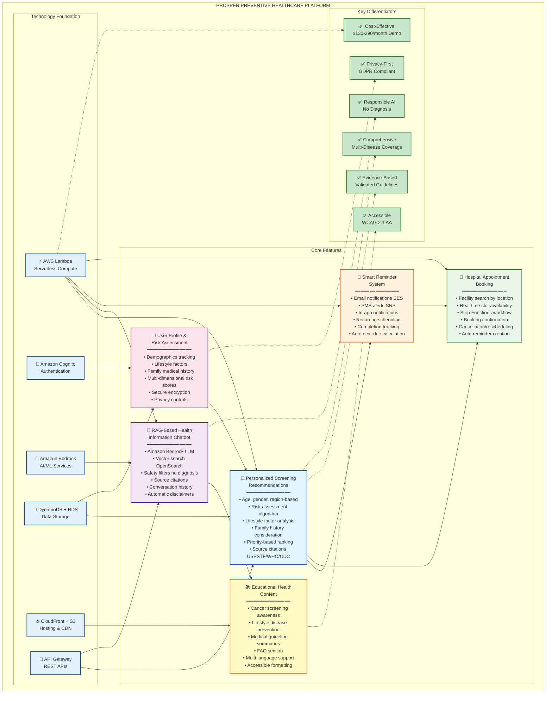

# Prosper - Solution Features

```mermaid
graph TB
    subgraph "PROSPER PREVENTIVE HEALTHCARE PLATFORM"
        
        subgraph "Core Features"
            F1[🎯 Personalized Screening<br/>Recommendations<br/>━━━━━━━━━━━━━━━<br/>• Age, gender, region-based<br/>• Risk assessment algorithm<br/>• Lifestyle factor analysis<br/>• Family history consideration<br/>• Priority-based ranking<br/>• Source citations USPSTF/WHO/CDC]
            
            F2[💬 RAG-Based Health<br/>Information Chatbot<br/>━━━━━━━━━━━━━━━<br/>• Amazon Bedrock LLM<br/>• Vector search OpenSearch<br/>• Safety filters no diagnosis<br/>• Source citations<br/>• Conversation history<br/>• Automatic disclaimers]
            
            F3[🔔 Smart Reminder<br/>System<br/>━━━━━━━━━━━━━━━<br/>• Email notifications SES<br/>• SMS alerts SNS<br/>• In-app notifications<br/>• Recurring scheduling<br/>• Completion tracking<br/>• Auto next-due calculation]
            
            F4[🏥 Hospital Appointment<br/>Booking<br/>━━━━━━━━━━━━━━━<br/>• Facility search by location<br/>• Real-time slot availability<br/>• Step Functions workflow<br/>• Booking confirmation<br/>• Cancellation/rescheduling<br/>• Auto reminder creation]
            
            F5[👤 User Profile &<br/>Risk Assessment<br/>━━━━━━━━━━━━━━━<br/>• Demographics tracking<br/>• Lifestyle factors<br/>• Family medical history<br/>• Multi-dimensional risk scores<br/>• Secure encryption<br/>• Privacy controls]
            
            F6[📚 Educational Health<br/>Content<br/>━━━━━━━━━━━━━━━<br/>• Cancer screening awareness<br/>• Lifestyle disease prevention<br/>• Medical guideline summaries<br/>• FAQ section<br/>• Multi-language support<br/>• Accessible formatting]
        end
        
        subgraph "Technology Foundation"
            T1[⚡ AWS Lambda<br/>Serverless Compute]
            T2[🔐 Amazon Cognito<br/>Authentication]
            T3[🤖 Amazon Bedrock<br/>AI/ML Services]
            T4[💾 DynamoDB + RDS<br/>Data Storage]
            T5[🌐 CloudFront + S3<br/>Hosting & CDN]
            T6[📡 API Gateway<br/>REST APIs]
        end
        
        subgraph "Key Differentiators"
            D1[✅ Evidence-Based<br/>Validated Guidelines]
            D2[✅ Responsible AI<br/>No Diagnosis]
            D3[✅ Privacy-First<br/>GDPR Compliant]
            D4[✅ Comprehensive<br/>Multi-Disease Coverage]
            D5[✅ Accessible<br/>WCAG 2.1 AA]
            D6[✅ Cost-Effective<br/>$130-290/month Demo]
        end
    end
    
    F1 --> F3
    F1 --> F4
    F2 --> F6
    F3 --> F4
    F5 --> F1
    
    T1 --> F1
    T1 --> F2
    T1 --> F3
    T1 --> F4
    T2 --> F5
    T3 --> F2
    T4 --> F1
    T4 --> F5
    T5 --> F6
    T6 --> F1
    T6 --> F2
    
    F1 -.-> D1
    F2 -.-> D2
    F5 -.-> D3
    F1 -.-> D4
    F6 -.-> D5
    T1 -.-> D6
    
    style F1 fill:#e1f5ff,stroke:#01579b,stroke-width:2px
    style F2 fill:#f3e5f5,stroke:#4a148c,stroke-width:2px
    style F3 fill:#fff3e0,stroke:#e65100,stroke-width:2px
    style F4 fill:#e8f5e9,stroke:#1b5e20,stroke-width:2px
    style F5 fill:#fce4ec,stroke:#880e4f,stroke-width:2px
    style F6 fill:#fff9c4,stroke:#f57f17,stroke-width:2px
    
    style T1 fill:#e3f2fd,stroke:#0d47a1,stroke-width:2px
    style T2 fill:#e3f2fd,stroke:#0d47a1,stroke-width:2px
    style T3 fill:#e3f2fd,stroke:#0d47a1,stroke-width:2px
    style T4 fill:#e3f2fd,stroke:#0d47a1,stroke-width:2px
    style T5 fill:#e3f2fd,stroke:#0d47a1,stroke-width:2px
    style T6 fill:#e3f2fd,stroke:#0d47a1,stroke-width:2px
    
    style D1 fill:#c8e6c9,stroke:#2e7d32,stroke-width:2px
    style D2 fill:#c8e6c9,stroke:#2e7d32,stroke-width:2px
    style D3 fill:#c8e6c9,stroke:#2e7d32,stroke-width:2px
    style D4 fill:#c8e6c9,stroke:#2e7d32,stroke-width:2px
    style D5 fill:#c8e6c9,stroke:#2e7d32,stroke-width:2px
    style D6 fill:#c8e6c9,stroke:#2e7d32,stroke-width:2px
```
